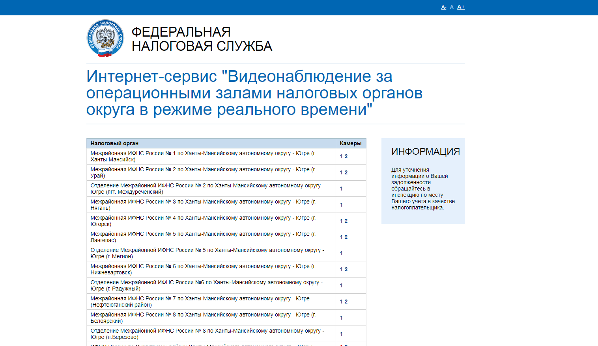
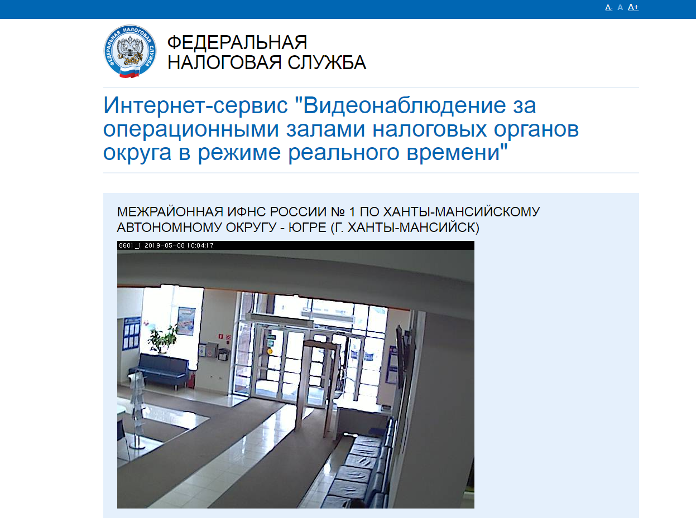

# Интернет-сервис видеонаблюдения за оперзалами Инспекций округа

## Описание
Сервис позволяет осуществлять просмотр изображений с видеокамер Инспекций, таким образом осуществлять мониторинг очереди

## Основание разработки
Необходимость за видеонаблюдением очередей в операционных залах Инспекций округа

## Изменения
* 07.12.2017 - разработка
* с 2018 года используется только внутри сети

## Требования
* Windows 2008 и выше
* Веб-сервер: IIS 7.0 и выше
* Microsoft SQL Server 2008 и выше
* NETFramework 4.5

## Установка
* Настроить подключение к БД Microsoft SQL Server в файле web.config (раздел `<connectionStrings>...</connectionStrings>`)

## Снимки экрана

